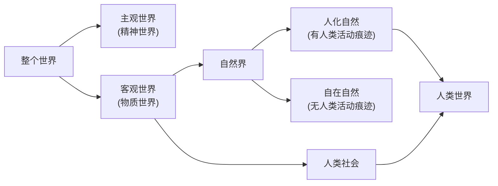

# 04010101世界多样性与物质统一性（唯物论）

### 1.1.1 哲学及其基本问题☆

#### 1.1.1.1 哲学
  哲学是系统化、理论化的世界观，是对自然知识、社会知识和思维知识的概括和总结。
#### 1.1.1.2 哲学基本问题

> 存在=物质=世界（物质世界）
> 思维=精神=意识

  ==存在和思维的关系问题==又称为==物质和精神的关系问题==，构成了全部哲学的基本问题。包括两个方面的内容：

- 其一： 存在和思维究竟==谁是世界的本原==，即物质和精神==何者是第一性==、何者是第二性的问题。对这一问题的不同回答，构成了==划分唯物主义和唯心主义的标准==。
- 其二： ==存在和思维有没有同一性==，即思维能否正确认识存在的问题（人能否正确认识世界（可知论与不可知论））。对这一问题的不同回答，构成了划分可知论和不可知论的标准。

> 强调对一件事物从不认识到认识：思维和存在具有同一性（可知论）

> [!note] 哲学的基本问题：
>
> - 其一：何者为第一性
>   - 物质第一：唯物主义
>   - 意识第一：唯心主义
> - 其二：是否具有同一性
>   - 具有：可知论
>   - 不具有：不可知论
> - 其三：存在方式：
>   - 辩证法：联系，发展，全面
>   - 形而上学：孤立，静止，片面

#### 1.1.1.3 哲学派别
  - 【唯物主义】
    - 古代朴素唯物主义：用某一种物质作为本原来解释世界，具有合理性和进步性。但是，把物质等同于具体的物质形态，又具有明显的局限性。（水，火，气，元气，灵气）
    - 近代形而上学唯物主义：以近代科学为基础，把物质等同于物质的微观结构层次——原子，虽然使唯物主义对物质概念的理解建立在自然科学发现的基础上，却不能正确理解哲学的物质概念与自然科学的物质概念之间共性与个性的关系，因而经不起自然科学进一步发展的检验，也经不起唯心主义的进攻。（机械性（机械唯物主义），形而上学性，不彻底性（半截子唯物主义））
    - 辩证唯物主义与历史唯物主义：20世纪初，列宁对物质概念作了全面的科学的规定：“物质是标志客观实在的哲学范畴，这种客观实在是人通过感觉感知的，它不依赖于我们的感觉而存在，为我们的感觉所复写、摄影、反映。”列宁的这一界定继承和汲取了以往唯物主义理解物质存在和物质概念的合理内容，实现了物质定义的科学化。
  - 【唯心主义】
>[!note] 唯心主义
> - 主观唯心主义：人的精神
> 	- 例子：心 我 感觉 观念 人
> - 客观唯心主义：人之外的精神
> 	- 例子：上帝 道 理 绝对观念 神

### 1.1.2. 物质

> 现代唯物主义=马哲
> 不依赖人类的意识存在

#### 1.1.2.1 物质含义
  所谓物质，就是==不依赖于人类的意识而存在（客观）==，并能==为人类的意识所反映的客观存在（实在）==；所谓物质范畴，就是标志==**客观实在**==的哲学范畴。
  **物质的共同特性是客观实在性（唯一特性，物质有，意识没有）**，它存在于人的意识之外，为人的意识所反映。
#### 1.1.2.2 物质和物质的具体形态的关系

  - 共性（普遍性  抽象  一般）
  - 个性（特殊性  具体  个别）
#### 1.1.2.3 马克思主义的物质范畴理论具有丰富而深刻的理论意义

  - 第一，坚持了唯物主义==一元论==，同唯心主义一元论和二元论划清了界限。
  - 第二，坚持了能动的反映论和可知论，批判了不可知论。
  - 第三，体现了唯物论和辩证法的统一，克服了形而上学唯物主义的缺陷。
  - 第四，体现了唯物主义自然观与唯物主义历史观的统一，为彻底的唯物主义奠定了理论基础。

### 1.1.3. 运动

#### 1.1.3.1 物质与运动的关系

  - ==运动是标志一切事物和现象的变化及其过程==的哲学范畴
  - ==物质的根本属性和存在方式是运动==
  - ==运动的基础和承担者是物质==

  > 实在基础=主体=载体=承担者

  > 物质->实在基础、承担者，主体（载体）->运动
  > 运动->根本属性和存在方式->物质

  > 割裂两者犯的错误：
  > - 承认物质，否认运动：形而上学
  > - 承认运动，否认物质：唯心主义

  - 物质和运动是不可分割的，运动是物质的运动，物质是运动着的物质，离开物质的运动和离开运动的物质都是不可想象的。
#### 1.1.3.2 运动和静止的关系
  ==运动是绝对的，静止是相对的==。运动的绝对性体现了物质运动的变动性、无条件性，静止的相对性体现了物质运动的稳定性、有条件性。
  相对静止是物质运动在一定条件下的稳定状态，具体包括两种状态：==空间的相对位置暂时不变==和==事物的根本性质暂时不变==。

  > 静止是运动的一种特殊状态

  运动和静止相互依赖、相互渗透、相互包含，“==动中有静、静中有动==”。无条件的绝对运动和有条件的相对静止构成了对立统一的关系。

  > 世界上任何事物都是绝对运动和相对静止的统一
  >

  > 承认静止，否认运动：形而上学
  > 承认运动，否认静止：相对主义诡辩论（今天的我不是昨天的我）
  >
#### 1.1.3.3 时空和运动的关系（时空观）
  ==时间和空间是物质运动的存在形式==。时间是指物质运动的持续性、顺序性，==特点是一维性==，即时间的流逝一去不复返。空间是指物质运动的广延性、伸张性，特点是三维性，即空间具有长、宽、高三方面的规定性。

> 时间和空间是测量物质运动的客观尺度
> 时间和空间通过物质运动的变化表现出来
> 物质运动和时空是不可分割的

> 时间的一维性做题方法：出现对称性、时间的词汇，或诗意表达感慨时光流逝、物是人非，劝诫珍惜时光

  ==物质运动总是在一定的时间和空间中进行的==，没有离开物质运动的“纯粹”时间和空间，也没有离开时间和空间的物质运动。物质运动与时间和空间的不可分割，证明了==时间和空间的客观性==。==具体物质形态的时空是有限的，而整个物质世界的时空是无限的==。

> 物质运动时间和空间的客观实在性是绝对的
> 物质运动时间和空间的具体特性是相对的

  物质、运动、时间、空间具有内在的统一性，它要求我们想问题、办事情都要以具体的时间、地点和条件为转移。

> 相对静止的地位：

- 是正确认识和利用事物的基础、前提
- 是理解和衡量事物运动的尺度
- 是过去运动的结果和未来运动的出发点

### 1.1.4. 物质与意识的辩证关系

#### 1.1.4.1 物质决定意识

  - ☆含义：意识是<u>的机能和属性，是客观世界的主观映象</u>。物质对意识的决定作用表现在意识的起源、本质和作用上。

  > 人脑是产生意识的物质器官
  > 主观映像=能动反应=摹写+创造
  > 意识的内容来源于/源泉是：客观世界
  > 只有摹写：直观消极反应
  > 意识不是人脑主观自生的
  >

  > 鬼神观念是对鬼神的虚幻反映✗
  > 鬼神观念是对事物本质的反映✗
  >

  - 起源：从意识起源来看，<u>意识是自然界长期发展的产物</u>（站在人进化的角度），它的形成和发展经历了三个阶段，即由<u>一切物质所具有的反应特性到低等生物的刺激感应性，再到高等动物的感觉和心理</u>，最终发展为人类的意识。意识不仅是自然界长期发展的产物，而且是社会历史发展的产物。<u>社会实践，特别是，在意识的产生和发展中起着决定性的作用</u>。一方面，劳动为意识的产生和发展提供了客观需要和可能；另一方面，在人们的劳动和交往中形成的语言促进了意识的发展。

  > 区分人与动物的本质：劳动
  > 语言是意识的物质外壳
  >

  - 本质：从意识本质来看，意识是人脑这样一种特殊物质的机能和属性，是客观世界的主观映象。因此，<u>意识在内容上是客观的，在形式上是主观的，是客观内容和主观形式的统一</u>。
#### 1.1.4.2 意识与人工智能
  所谓人工智能，就是把人的部分智能活动机器化，让机器具有完成某种复杂目标的能力，它实质上是<u>对人脑</u>组织结构与思维运行机制<u>的模仿，是人类智能的物化</u>。建立在大数据与不断升级的各种算法技术基础上的现代人工智能，正在深刻影响当代人类生活。

> 人工智能是人本质力量的对象化、现实化

  尽管<u>人工智能可以模拟和扩展人脑的某些活动</u>，甚至在计算速度和准确度、程序化任务的执行能力等方面<u>（在某些方面）的表现超出人类所能</u>，但即使是计算能力最强大、最先进的智能机器，也不能达到人类智能的层级，不能真正具有人的意识，<u>不能取代或超越人类智能</u>。

- 第一，人类意识是知情意的统一体，而人工智能只是对人类的理性智能的模拟和扩展，不具备<u>情感、信念、意志（补充：思维，意识，实践）等人类意识形式</u>。
- 第二，社会性是人的意识所固有的<u>本质属性（社会关系）</u>，而人工智能不可能真正具备人类的社会属性。
- 第三，人类的自然语言是思维的物质外壳和意识的现实形式，而人工智能<u>难以完全具备理解自然语言真实意义的能力</u>。
- 第四，人工智能能够获得人类意识中可以化约为<u>数字信号</u>的内容，但人脑总有许多东西是<u>无法被化约的</u>。
#### 1.1.4.3 意识对物质具有反作用

> 正确的意识会促进物质的发展
> 错误的意识会阻碍物质的发展

  物质决定意识，意识对物质具有反作用，这种反作用就是意识的<u>能动作用（正向的想、做的词）</u>。意识的能动作用主要表现在：

- 第一，意识活动具有目的性和计划性。
- 第二，意识活动具有创造性。
- 第三，意识具有指导实践改造客观世界的作用。
- 第四，意识具有调控人的行为和生理活动的作用。

> 意识可以转化为物质（通过实践）

### 1.1.5 规律

- **5.1 规律含义：** 事物本<u>身所固有的</u>本质的必然的稳定的<u>联系</u>。
- **5.2 规律特点：
  - ** ==客观性==（注意区分自然规律和社会规律）。

> 创造 消灭 产生 影响 创新规律都是错的，违背了客观性，但可以改变规律发挥作用的条件/形式
>
> - 重复性
> - 没有阶级性
>   自然规律与社会规律：
>   自然界、自然规律：自发，没有人的意识参与
>   人、人类社会、社会规律：自觉，有人的意识参与

- **5.3 规律的客观性和人的主观能动性辩证关系**（原理）
  - **一方面，** <u>尊重客观规律是正确发挥主观能动性的前提</u>。
  - **另一方面，** 只有充分发挥主观能动性，才能正确认识和利用客观规律。
  - 尊重事物发展的客观规律性与发挥人的主观能动性是辩证统一的，<u>实践</u>是客观规律性与主观能动性统一的基础。

> - 方法论：在尊重规律的基础上充分发挥主观能动性

> | 规律 | 主观能动性 | 犯的错误                 |
> | ---- | ---------- | ------------------------ |
> | ✓   | ✗         | 宿命论（客观唯心主义）   |
> | ✗   | ✓         | 唯意志论（主观唯心主义） |

- **5.4 正确发挥人的主观能动性，有以下三个方面的前提和条件：**
  - **第一，** 从实际出发是正确发挥人的主观能动性的前提。
  - **第二，** 实践是正确发挥人的主观能动性的基本途径。
  - **第三，** 正确发挥人的主观能动性，还需要依赖于一定的物质条件和物质手段。

#### 6. 物质世界的二重性（新增）

  人类的出现，特别是人类改造世界的实践活动，使<u>世界发生了二重分化，即从自然界中分化出人类社会，从客观世界中分化出主观世界</u>。

- **一方面，** 世界分化为自然界与人类社会。人类社会与自然界的不同主要在于，在自然界中一切都是自发产生的，而在人类社会中一切都打着人的意识的印记，是人有目的的实践活动的结果。自然界与人类社会不是截然分开的，而是交叉重叠和相互作用的。在自然界中有“人化自然”。在社会中有自然物质和自然力的运用，而构成社会存在基础的物质生产本身就是人与自然的物质变换。
- **另一方面，** 世界分化为客观世界和主观世界。客观世界是不依赖于人的思想意识而存在的现实世界，包括自然界和人类社会。主观世界是指人的意识世界，是人的头脑反映和把握物质世界的精神活动的总和。主观世界从客观世界中分化出来，具有相对独立性。从根本上说，主观世界是对客观世界的反映，并反作用于客观世界。
  可以说，<u>人的实践活动</u>是自然界与人类社会、客观世界与主观世界相分化的关键，也是它们相统一的<u>关键</u>。

> 分化与统一的关键：人的实践活动
> 总结：统一的基础是实践
> 1. 规律和主观能动性统一的基础：实践
> 2. 人和世界同时改变的基础：实践
> 3. 认识世界和改造世界统一的基础：实践

#### 7. 世界的物质统一性

> 是多样性的统一性

> 考法：
>
> - 列举很多种事物
> - 列举一种新发现的事物（科研新发现）

  世界的统一性问题，是回答世界上的万事万物<u>有没有统一性</u>，即<u>有没有共同的本质或本原的问题</u>。马克思主义认为，<u>物质是世界的本原</u>，=<u>世界统一于物质</u>。

- **首先，** 世界的物质统一性体现在，意识统一于物质。
- **其次，** 世界的物质统一性还体现在，人类社会也统一于物质。
  - **第一，** 人类社会是物质世界的组成部分。
  - **第二，** 人类获取生活资料的活动是物质性的活动。
  - **第三，** 人类社会存在和发展的基础是物质资料的生产方式。
- 世界的物质统一性原理是马克思主义的基石。
- <u>一切从实际出发</u>，是世界的物质统一性原理在现实生活中和实际工作中的生动体现。

> 一切从实际出发：彻底的唯物主义一元论的根本要求、方法论
