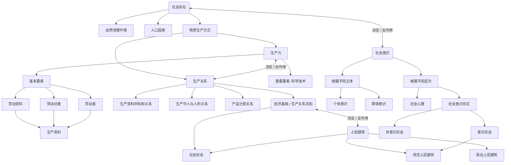

# 040103人类社会及其发展规律
- [[04010301人类社会及其发展规律]]
- [[04010302社会历史发展的动力]]
- [[04010303人民群众在历史发展中的作用]]

> 唯物史观/历史唯物主义
![[IMG_20260620_140242.jpg]]

![[04010301人类社会及其发展规律]]
![[04010302社会历史发展的动力]]
![[04010303人民群众在历史发展中的作用]]