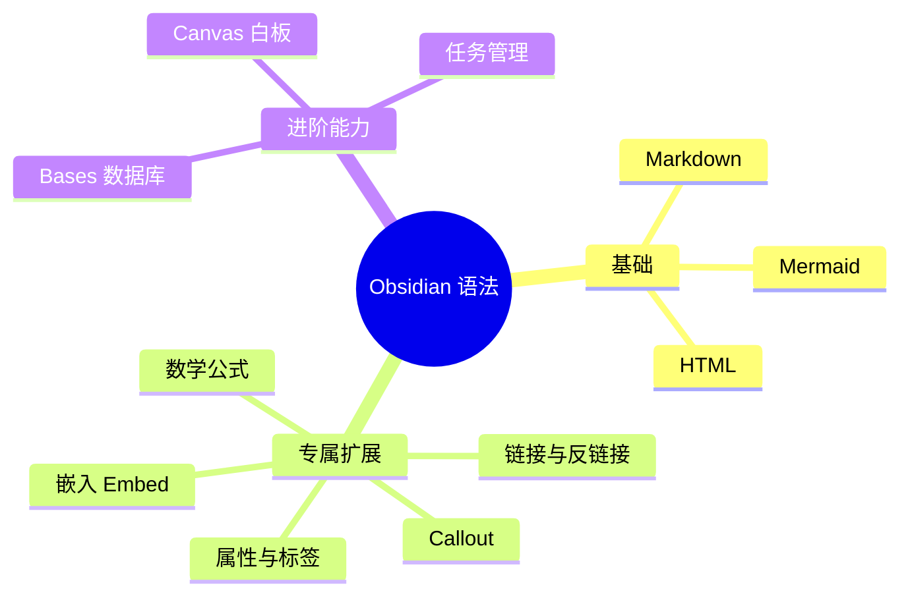

# 🏠 Obsidian 语法大全

> [!abstract] 本仓库是什么
> 这是一套 **Obsidian 笔记语法演示库**，覆盖从标准 Markdown 到 Obsidian 专属扩展（双链、嵌入、Callout、属性、公式、Mermaid、HTML、Bases、Canvas）的全部语法，并用真实的链接把每篇笔记串联成一个**可跳转、可关联**的完整知识网络。

## 🗺️ 笔记结构总览

## 📚 语法笔记导航

| 类别 | 笔记 | 核心内容 |
|------|------|----------|
| ✍️ 基础 | [[01-普通Markdown语法]] | 标题、列表、表格、代码、脚注、任务 |
| 📈 图表 | [[02-Mermaid图表]] | 17 种 Mermaid 图 + 节点链接到笔记 |
| 🌐 HTML | [[03-HTML语法]] | 下划线、颜色、居中、折叠、iframe |
| 🔗 链接 | [[04-链接与反链接]] | wikilink、别名、标题/块链接、反链接 |
| 🖼️ 嵌入 | [[05-嵌入Embed]] | 嵌入笔记、图片、PDF、Bases、搜索 |
| 💬 提示框 | [[06-Callout提示框]] | 全部 callout 类型、折叠、嵌套 |
| 🏷️ 属性 | [[07-属性与标签]] | Frontmatter、内联标签、默认属性 |
| 🧮 公式 | [[08-数学公式与脚注]] | LaTeX 行内/块级公式、脚注 |

## 🧪 示例与演示文件

- 项目笔记：[[项目Alpha]] · [[项目Beta]] —— 带属性的被引用笔记（用于反链接演示）
- 会议记录：[[会议记录]] —— 演示标题/块级链接与嵌入
- 待办清单：[[每日待办]] —— 演示任务列表语法
- 可视化白板：[[演示/Obsidian语法全景.canvas]] —— 思维导图 Canvas
- 数据库视图：[[演示/项目数据库.base]] —— 按标签/属性聚合笔记

## 💡 关键能力演示

- ✅ **跨文件跳转**：点击任意语法笔记里的 `[[ ]]` 链接即可跳到目标笔记或段落。
- ✅ **反链接**：打开右侧栏「反链」，可看到谁引用了当前笔记（本页引用了很多笔记，它们都会显示本页为反向链接）。
- ✅ **图视图**：打开命令面板 → 「图谱：查看图谱」，所有笔记的关联关系一目了然。
- ✅ **嵌入**：见 [[05-嵌入Embed]]，可直接把 [[会议记录#关键决策]] 内嵌到任意笔记。
- ✅ **关联查询**：见 [[演示/项目数据库.base]]，按 `status` / `priority` / `due` 自动聚合笔记。

> [!tip] 建议的阅读顺序
> 从 [[01-普通Markdown语法]] 按编号读到 [[08-数学公式与脚注]]，再回来看 [[演示/Obsidian语法全景.canvas]] 的白板视图，最后打开 [[演示/项目数据库.base]] 查看数据聚合效果。

## 📎 本页如何产生反链接

本页大量引用其他笔记，因此这些笔记的**反链接面板**中都会出现本页。例如打开 [[项目Alpha]]，即可在右侧「反链」区域看到本页与 [[04-链接与反链接]] 的引用。

可以直接回答，基于 Obsidian 的 Markdown 解析规则。

