# 📈 Mermaid 图表

> [!abstract] 说明
> Obsidian **原生支持** [Mermaid](https://mermaid.js.org) 图表：把代码放进以 `mermaid` 为语言标记的代码块即可在阅读视图渲染。本页演示全部常用图表类型，并展示如何把节点链接到笔记。

## 一、流程图 Flowchart（graph）

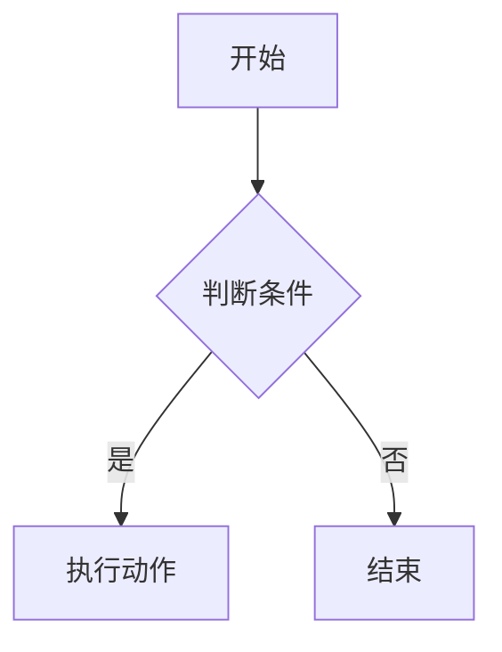

指定方向：`graph LR`（左右）、`graph TD`（上下）、`graph RL`、`graph BT`。

带子图（subgraph）的流程图：

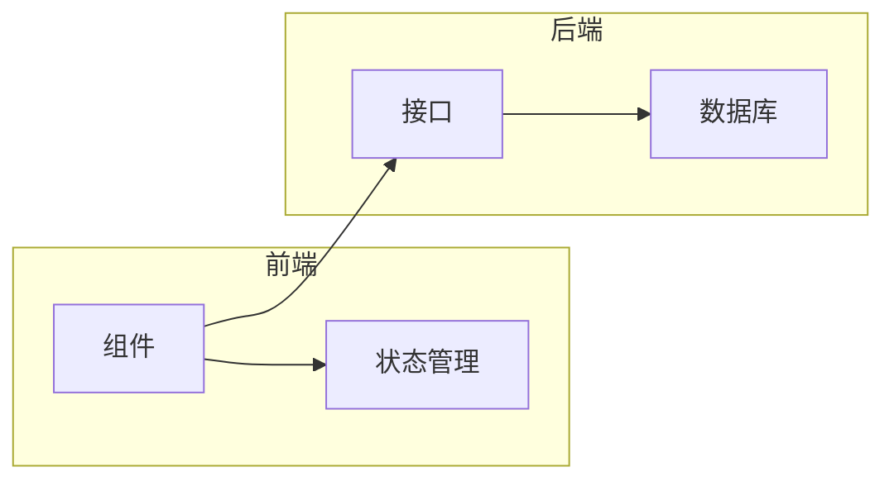

## 二、把节点链接到笔记（internal-link）

用 `class 节点 internal-link;` 让节点变成**内部链接**，点击即可跳转到对应笔记：

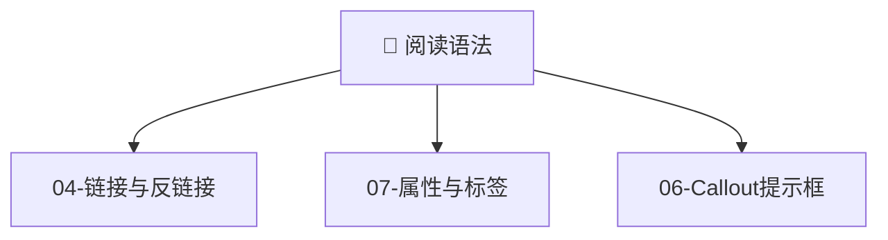

## 三、时序图 Sequence Diagram

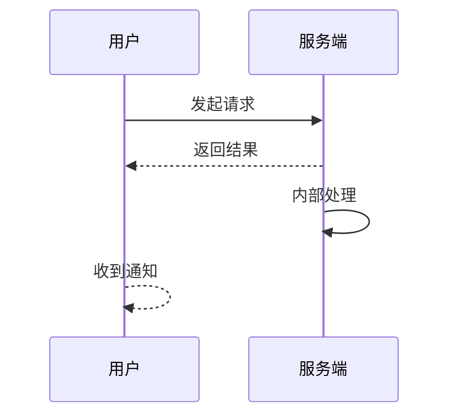

## 四、类图 Class Diagram

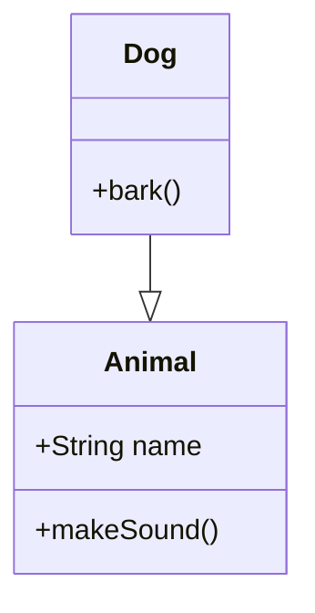

## 五、状态图 State Diagram

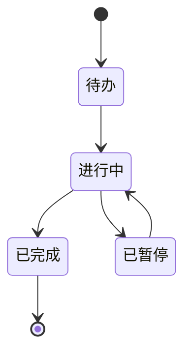

## 六、实体关系图 ER Diagram

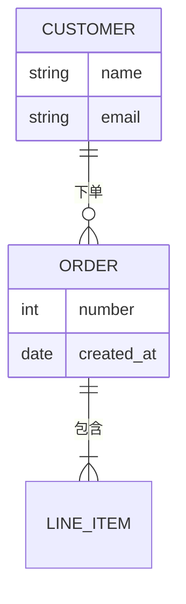

## 七、用户旅程图 User Journey

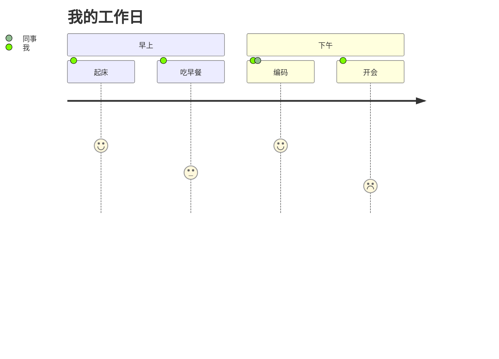

## 八、甘特图 Gantt

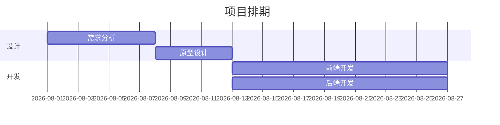

## 九、饼图 Pie

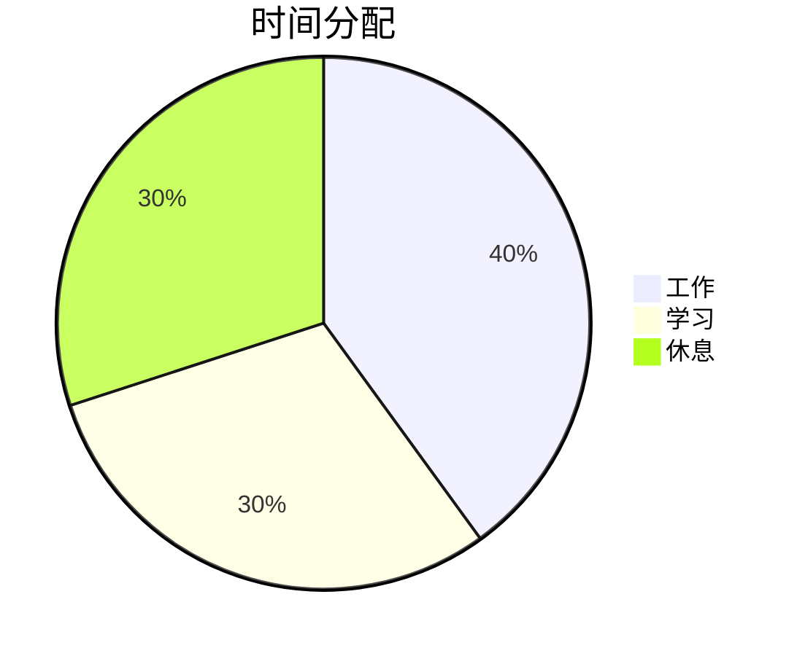

## 十、四象限图 Quadrant

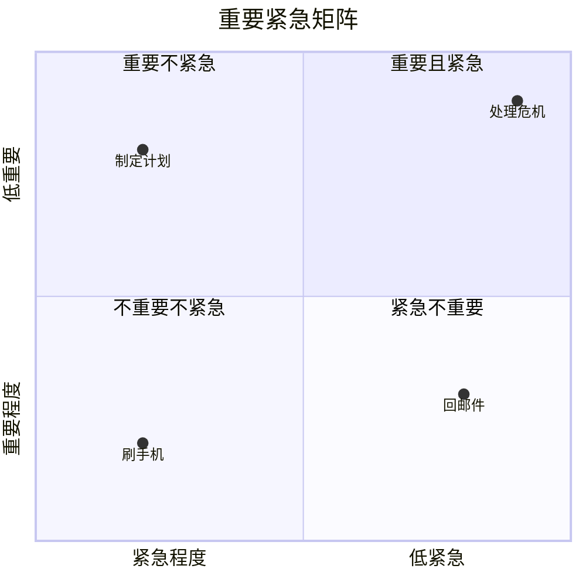

## 十一、时间线 Timeline

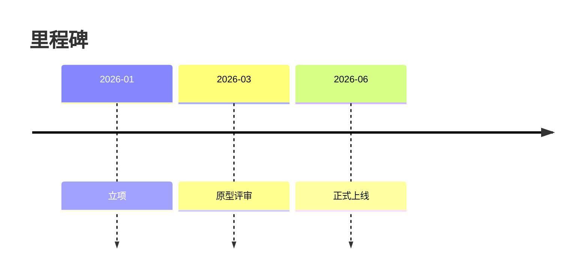

## 十二、Git 图 Gitgraph

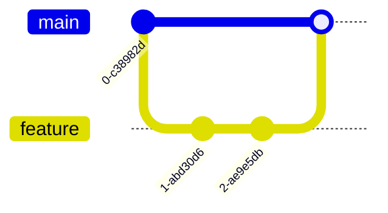

## 十三、思维导图 Mindmap

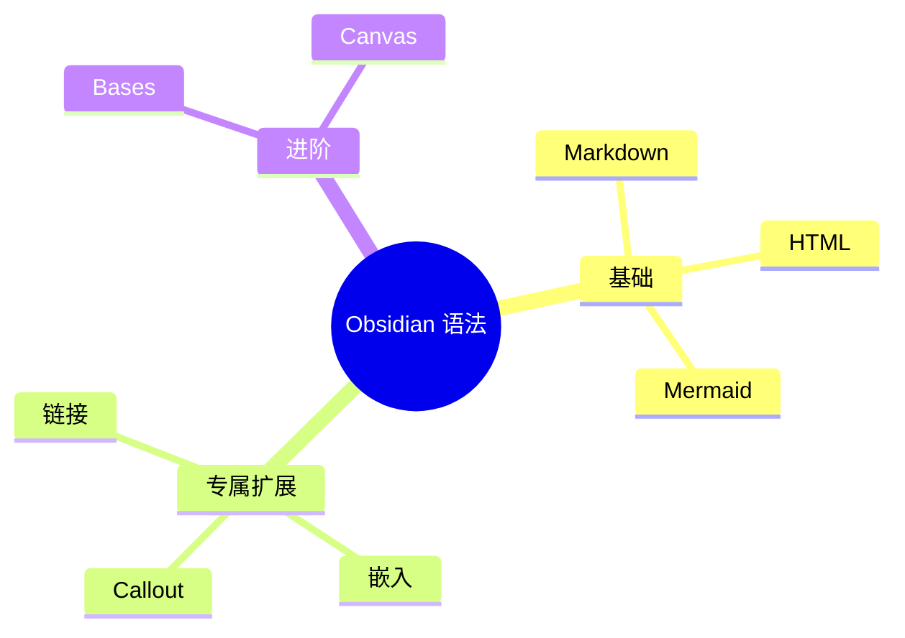

## 十四、折线/柱状图 XYChart

```mermaid
xychart-beta
    title "月度销售额"
    x-axis [一月, 二月, 三月, 四月]
    y-axis "销售额(万)" 0 --> 60
    bar [10, 25, 40, 55]
    line [8, 20, 35, 50]
```

## 十五、桑基图 Sankey

```mermaid
sankey-beta
    Electricity [75] --> Home [65]
    Home [65] --> Heating [55]
    Home [10] --> Appliances [10]
```

## 十六、块图 Block Diagram

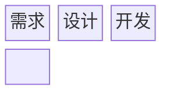

## 十七、C4 图（系统上下文）

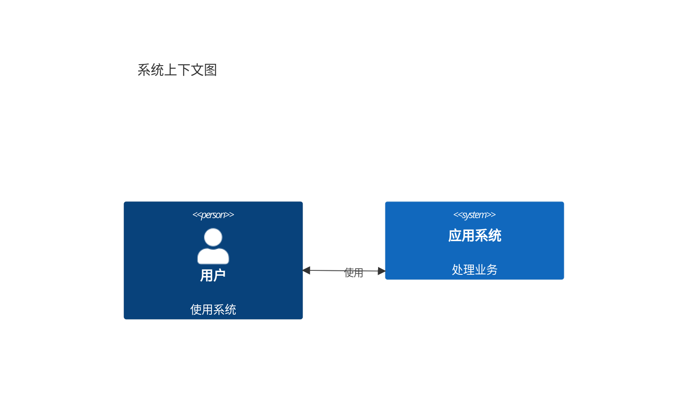

## 小结

- 所有图都以 `mermaid` 语言标记的围栏代码块包裹。
- 节点可通过 `class X internal-link;` 链接到笔记，与 [[04-链接与反链接]] 联动。
- 更多语法与进阶选项见 [Mermaid 官方语法参考](https://mermaid.js.org/intro/syntax-reference.html)。

---

*返回总览：[[Home]] · 上一篇：[[01-普通Markdown语法]] · 下一篇：[[03-HTML语法]]*
