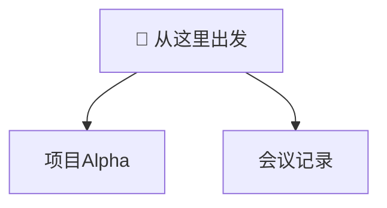

# 🔗 链接与反链接

> [!abstract] 本页内容
> Obsidian 的核心竞争力是**双向链接**。本页演示 wikilink 的全部形式，以及如何用标题、块、别名实现**精确跳转**，并通过**反链接面板**与**图视图**实现知识关联。

## 一、基础 Wikilink（双链）

语法：`[[笔记名]]` —— 只需文件名即可解析，与所在文件夹无关。

- `[[项目Alpha]]` → [[项目Alpha]]
- `[[项目Beta]]` → [[项目Beta]]

> [!tip] 为什么用双链而不是普通链接？
> - wikilink 只按**文件名**匹配，改名时全库引用自动更新。
> - 双链会生成**反向链接**，形成知识网络。
> - 外部网址才用 Markdown 链接，见第八节。

## 二、显示别名

语法：`[[笔记名|显示的文本]]`

- `[[项目Alpha|查看 Alpha 项目]]` → [[项目Alpha|查看 Alpha 项目]]
- `[[会议记录|会议纪要]]` → [[会议记录|会议纪要]]

## 三、链接到标题

语法：`[[笔记名#标题]]` —— 跳转到目标笔记的某个标题（小节）。

- `[[会议记录#关键决策]]` → [[会议记录#关键决策]]
- `[[项目Alpha#核心目标]]` → [[项目Alpha#核心目标]]
- 本页内部标题：`[[#三、链接到标题]]` → [[#三、链接到标题]]

## 四、链接到块（Block）

**块** = 任意段落 / 列表 / 引用 / 表格。给块定义 ID 后即可精确定位。

语法：`[[笔记名#^块ID]]`

- `[[项目Alpha#^alpha-goal]]` → [[项目Alpha#^alpha-goal]]
- `[[会议记录#^decision-1]]` → [[会议记录#^decision-1]]

定义块 ID 的两种方式：
1. 段落末尾直接追加：`文字内容 ^块ID`
2. 列表/引用之后单独一行：在下一行写 `^块ID`

> 试试：点击上面两个块链接，会跳到目标笔记的**对应段落**，而不是整个文件。

## 五、同笔记内部链接

- 跳转到本页标题：`[[#二、显示别名]]` → [[#二、显示别名]]
- 跳转到本页某个块：`[[#^block-id]]`（需先定义块 ID）
- 当前笔记内跳转无需文件名。

## 六、链接到尚不存在的笔记

`[[待创建的笔记]]` → [[待创建的笔记]]

> 点击上面的链接即可**创建新笔记**。Obsidian 会在新笔记中自动生成指向它的反链接，这就是"从未来建立链接"的用法。

## 七、路径链接与附件链接

- 完整路径：`[[示例/会议记录]]` → [[示例/会议记录]]
- 白板文件：`[[演示/Obsidian语法全景.canvas]]` → [[演示/Obsidian语法全景.canvas]]
- 数据库文件：`[[演示/项目数据库.base]]` → [[演示/项目数据库.base]]

## 八、Markdown 普通链接（外链）

- 行内链接：[Obsidian 官网](https://obsidian.md)
- 自动识别 URL：https://help.obsidian.md
- 引用式链接：[Obsidian 帮助][help]

[help]: https://help.obsidian.md

## 九、别名（Aliases）也能被链接

[[项目Alpha]] 在 frontmatter 中定义了别名 `Alpha`，因此 `[[Alpha]]` 也能跳转过去：

`[[Alpha]]` → [[Alpha]]

> 别名让同一篇笔记拥有多个"入口名"，适合英文名 + 中文名并存。

## 十、反链接（Backlinks）—— 谁引用了当前笔记？

**反链接**是 Obsidian 双向链接的"反向"：列出所有指向当前笔记的链接。

以 [[项目Alpha]] 为例，它的反链接包括：
- [[Home]]（首页）
- [[04-链接与反链接]]（本页）
- [[05-嵌入Embed]]

> [!info] 查看反链接的三种方式
> 1. **右侧栏** →「反链」（Backlinks）面板。
> 2. 笔记底部自动出现的「反向链接」区块。
> 3. **图视图**：命令面板 →「图谱：查看图谱」，看节点之间的连线与箭头。

## 十一、Mermaid 中的笔记链接

Mermaid 节点可用 `class X internal-link;` 变成可点击的笔记链接（详见 [[02-Mermaid图表]]）：

## 十二、动手练习

点击下列链接，体验跨文件、跨段落跳转：

1. [[项目Alpha#核心目标]] —— 跳转到项目 Alpha 的「核心目标」小节
2. [[会议记录#^decision-1]] —— 跳转到会议记录的某个块
3. [[每日待办]] —— 查看待办清单
4. [[演示/Obsidian语法全景.canvas]] —— 打开白板
5. [[Home]] —— 返回首页

---

*返回总览：[[Home]] · 上一篇：[[03-HTML语法]] · 下一篇：[[05-嵌入Embed]]*
